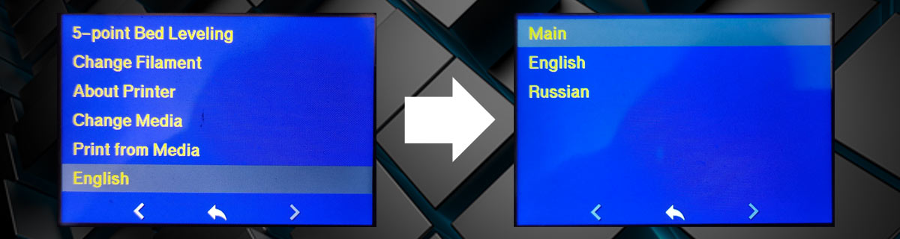
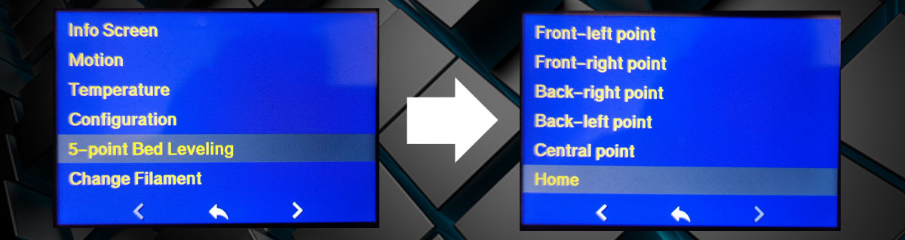
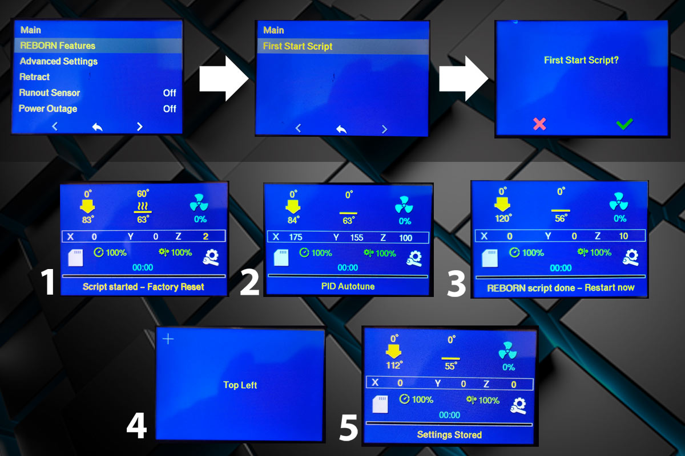
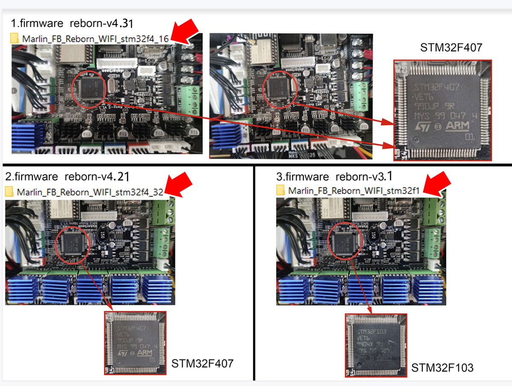

# Marlin 3D Printer Firmware for Flying Bear Reborn


Это конфигурация сделана для принтера Flying Bear Reborn с использованием ветки Марлина 2.0.9.1 для принтеров Flying Bear Ghost, автор Sergey1560 (https://github.com/Sergey1560/Marlin_FB4S). На данный момент поддерживаются платы MKS Robin Nano 1.x, MKS Robin Nano v1.3 - на доработке, временно недоступна, MKS Robin Nano-s v1.3- на доработке, временно недоступна

Эта ветка содержит дополнительный код для работы с модулем [MKS WIFI](https://github.com/makerbase-mks/MKS-WIFI), установленным в Reborn. Загрузка файлов через стандартный plugin в Cura.

Если у вас есть какие-то вопросы по настройке прошивки или по ее использованию, вы можете задать свой вопрос в [telegram группе](https://t.me/Reborn_3D).


## Особенности прошивки для принтера Reborn
* В меню принтера добавлен выбор языка интерфейса. Доступны английский и русский языки. Переключить язык можно даже во время выполнения печати.



* В меню принтера добавлен пункт 5-Point Bed Leveling. Это аналог быстрой настройки стола из оригинальной прошивки - барашками при помощи листка бумаги, перемещаясь по 5 точкам. Перед началом настройки обязательно нужно определить нулевую координату (Home).



* В меню Настройки добавлен пункт REBORN Features, с подменю First Start Script. Скрипт  сбрасывает настройки EEPROM, настраивает PID сопла и PID стола, запускает калибровку сенсора экрана. Предназначен для тех, кто ставит прошивку Марлин впервые и для опытных пользователей, желающих сэкономить время на настройку параметров прошивки. Время выполнения скрипта - 15...20 минут. По окончании звучит звуковой сигнал и на экране принтера появляется надпись с требованием перезагрузки принтера. После перезагрузки выполняется калибровка экрана.



* Увеличено до 1,5 минут время самовозврата на главный экран. Теперь, например, работать с меню Tune стало проще, есть дополнительное время для удобного внесения корректировок в процесс печати.

* Немного изменена цветовая палитра основного меню. Подобраны такие цвета интерфейса, которые хорошо считываются с экрана через синее стекло закрытых дверей принтера.


* Сведения о текущих температурах принтер отправляет хосту каждые 6 секунд.

* Исправлены куча косяков, про которые вы теперь даже не узнаете).


### Варианты прошивки
Как выбрать прошивку под свою плату:



Если вас устраивает типовой вариант конфигурации, взять готовые файлы прошивки можно в разделе [Releases](https://github.com/SergPanin/Marlin_REBORN/releases)

Для настройки под свои нужды, прошивку нужно собрать самостоятельно.

Вернуть стандартную прошивку можно в любой момент. Просто запишите ее на SD и включите принтер. Оригинальные прошивки Flying Bear Reborn здесь: https://drive.google.com/drive/folders/1io_umO7EgzTLTE5pZwcePNe2q0zt-har


## Первое, что нужно сделать, после прошивки

Первое, что нужно сделать после прошивки, это проинициализировать EEPROM (память внутри принтера), сбросив настройки по-умолчанию. После прошивки там находится мусор, который может привести к совершенно необъяснимому поведению.

Делается это через меню Configuration -> REBORN Features -> First Start Script. (сброс настройки EEPROM, настройка PID сопла и PID стола, запуск калибровки сенсора экрана)

или через меню Configuration -> Advanced settings -> Initialize eeprom. (Только сброс EEPROM)


## MKS WIFI модуль

Если у вас уже был настроен WIFI в оригинальной прошивке, дополнительных действий по настройке не потребуется. 

### Работает
* Отображение температуры в Cura
* Просмотр содержимого SD карты
* Удаление файлов с SD карты
* Загрузка файлов на SD карту
* Автоматический запуск печати при загрузке файла.
* Настройка WIFI модуля (сеть и пароль)

### Не работает
* **Имена файлов на русском** Переименуйте файл в Cura
* Работает только с картами стандарта SD card v2.0 и новее. Это все карты от 1Гб и больше.
* Отображение состояния принтера (печатает, не печатает) в Cura


## SD карта
Если после прошивки экран зависает, попробуйте заменить SD-карту. Если есть проблемы с передачей файла по WIFI, попробуйте заменить SD-карту. В Марлин 2.0.9.1 принесли новый код работы с железом, есть проблемы с некоторыми SD-картами. Ждем, что в следующих версиях поправят.


### BLTouch
Bltouch отключен. [О подключении Bltouch](https://sergey1560.github.io/fb4s_howto/bltouch/).


### Firmware retract
Без использования опции "firmware retract" слайсер делает ретракты командами движения G1. В том месте, где нужно выполнить ректракт вставляются команды:

```
G1 E-2 F2100 ; "Откатить" 2мм со скоростью 35мм/с (2100 мм/мин)
команды движения
G1 E2 F2100  ; Вернуть обратно 2мм со скоростью 35мм/с (2100 мм/мин)
```
Для ректрактов в Marlin поддерживаются специальные команды - [G10](https://marlinfw.org/docs/gcode/G010.html) и [G11](https://marlinfw.org/docs/gcode/G011.html). В слайсере нужно включить поддержку firmware retract и тогда в том месте, где нужно "откатить" пластик будет вставлена команда G10, а там, где нужно его вернуть G11. Если никакие дополнительные параметры не установлены, будут использованы параметры из прошивки (2мм, 35мм/с). 

Установить параметры можно командами [M207](https://marlinfw.org/docs/gcode/M207.html) и [M208](https://marlinfw.org/docs/gcode/M208.html).

Для того, чтобы можно было настраивать ретракт в слайсере, в стартовый код нужно добавить M207. Как правило, слайсеры позволяют добавить макрос в качестве параметров команды.

Firmware retract позволяет изменять значения ректракта из меню принтера прямо во время печати.

В Marlin есть функция автоматического распознования ректрактов командами G1 и замена их на G10/G11. Это функция отключена.

Если в слайсере не включена поддержка firmware retract, все будет работать как обычно.
